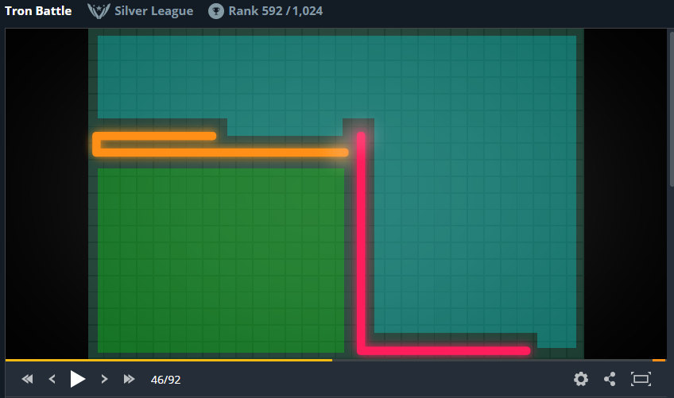

# Tron
Repozytorium do konkursu Tron

[https://www.codingame.com/multiplayer/bot-programming/tron-battle](https://www.codingame.com/multiplayer/bot-programming/tron-battle)

In this game your are a program driving the legendary tron light cycle. The light cycle moves in straight lines and only turns in 90° angles while leaving a solid light ribbon in its wake. Each cycle and associated ribbon features a different color.

Should a light cycle stop, hit a light ribbon or go off the game grid, it will be instantly deactivated. The last cycle in play wins the game.

# Rejestracja
Rejestracja na stronie Codingame nie jest obowiązkowa, ale napisane programy można jedynie testować na podstawowym zestawie testów oraz nie moga być oceniane lub, w przypadku konkursów, nie mogą "walczyć" z programami innych uczestników. Po rejestracji dostępna jest pełna funkcjonalność.

[Zarejestruj na stronie Codingame](https://www.codingame.com/servlet/urlinvite?u=543181)

# Kody źródłowe
Katalog Java zawiera pliki źródłowe napisane w Javie. Katalog JavaScript to program napisany w JavaScripcie.

# Wersje programu

## Wersja pierwsza

W pierwszej wersji programu sprawdzamy jedynie, czy sąsiednie pola na planszy są wolne. Jeżeli tak, to ruch jest możliwy. Pola sprawdzane są w kolejności: lewe, prawe, górne, dolne. Ta wersja programu umożliwia przejście do "Wood 1 League" i zatrzymanie się tuż przed bossem ;-)

## Wersja druga

Kolejne "naiwne" rozwiązanie: jeżeli rozpoczynamy grę w górnej części planszy, to wyszukujemy dozwolone ruchy w kolejności LEFT, RIGHT, DOWN, UP. Jeżeli rozpoczynamy w dolnej części planszy, to LEFT, RIGHT, UP, DOWN.

## Wersja trzecia

Wykorzystajmy [algorytm flood fill](https://pl.wikipedia.org/wiki/Flood_fill) do sprawdzenia, w którym kierunku należy się udać, aby trafić na obszar z największą liczbą wolnych pól. Najbardziej jest to przydatne w momencie dojścia do krawędzi planszy lub pozostawionego wcześniej śladu. Dzięki temu algorytmowi możemy zliczyć wszystkie wolne pola, do których możemy dojść.

Na poniższym schemacie gracz pomarańczowy idąc w prawo dochodzi do śladu drugiego gracza. Może wybrać ruch w dół na zielony obszar lub w górę na niebeski obszar. Niebieski obszar jest większy.

